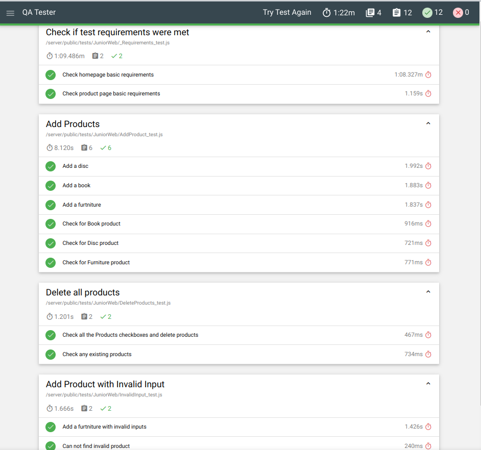

# Scandiweb-Test-Assignment

## How to use:

- Clone the repo.
- Run `composer install` to install dependencies.
- Copy the .env.example file and rename it to .env and add your environment variable in it.
- Create the database and run the `Database/Schema.sql` file to create the database.
- Inside the public folder run this command to serve the project  `php -S localhost:8080`  you can change the port as you prefer.
- Uncomment the `set_exception_handler` function in `public/index.php` file to display errors in development mode.

## Test result:
 

## Live preview:

[I hope it still up.](https://scandiwebtaskassignment.000webhostapp.com/) Try to ues VPN if it does not open.
